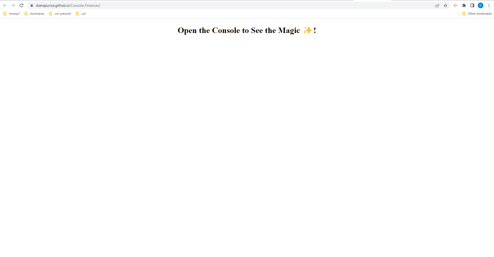
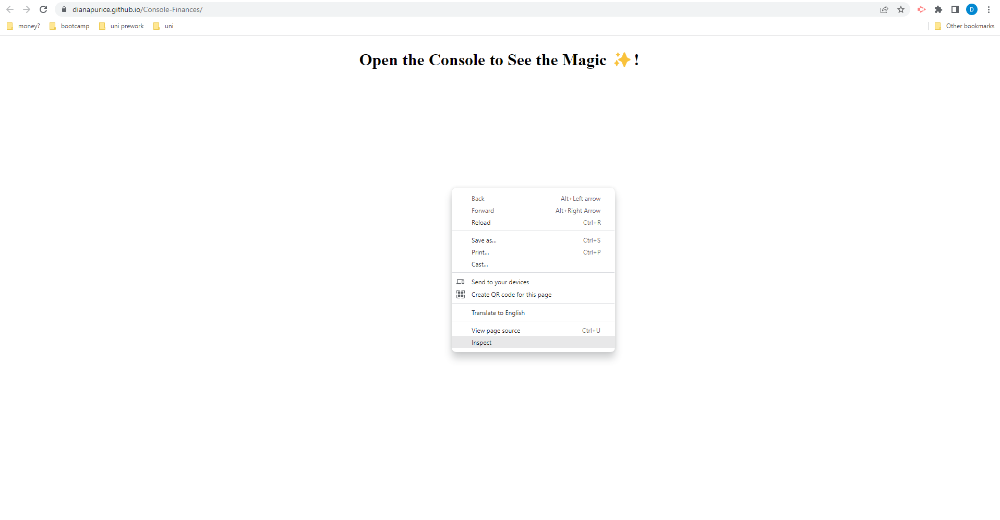
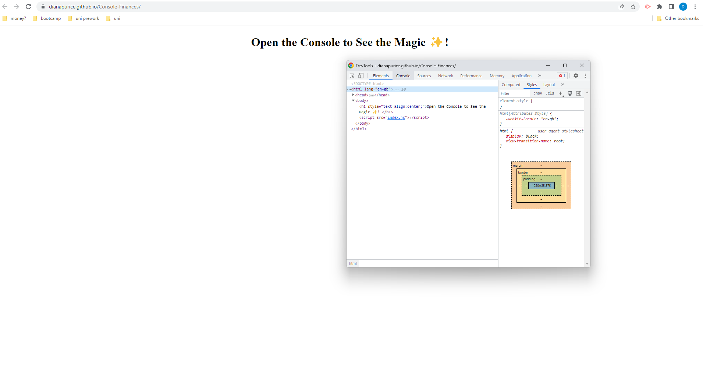
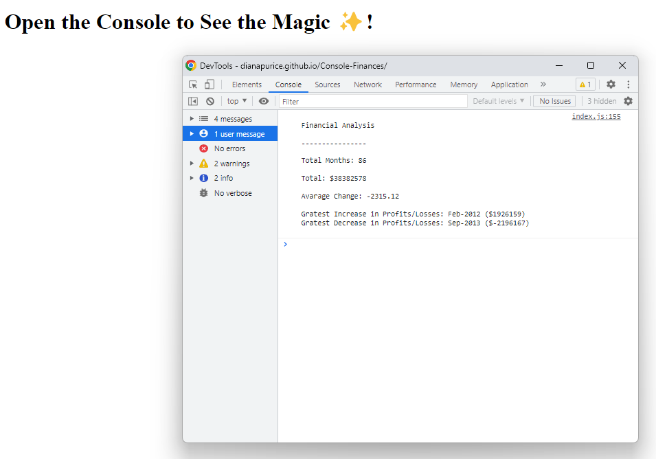

# Console-Finances

## Description

The application offers a basic statistical analysis of a given dataset.

## Installation

No instalation required.
Can be accessed at:
The results can be seen in the console.

## Usage

When accesing the page this is the view you would get.

To see the results open the inpector tools.

Then navigate to the console.

The results of the analysis would be displayed as in the following image.

## Credits

To round the Avarage Change result in index.js, line 149, I have read the documentation about the Number's methos 'tofixed()' from: 
https://developer.mozilla.org/en-US/docs/Web/JavaScript/Reference/Global_Objects/Number/toFixed.

To manipulate the Arrays that can be found in the index.js file I have read the documentation about array from: 
https://www.w3schools.com/jsref/jsref_obj_array.asp

## License

Please refer to the LICENCE in the repo. 